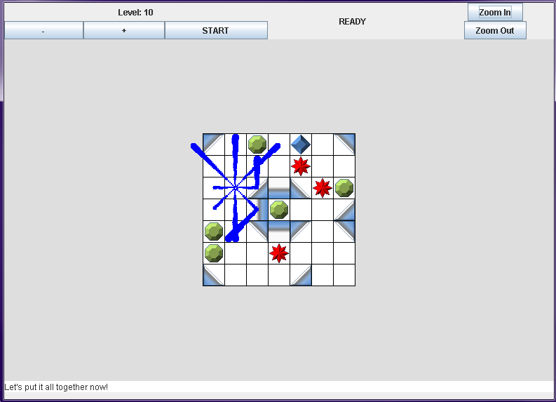

# Blockbeam
Java Applet-based single-player strategy/puzzle game.

## How to run:
Click "run.bat" to launch the game's Java Applet window.
Click "compile.bat" to recompile if there are any Java-related issues, then try running again.

## Objective:
Capture all of the green and blue gems and avoid the red gems. Clicking on a blue gem will capture it and release multiple beams that can also capture neighboring gems. Green gems can only be captured with these beams. Red gems must not be captured. As the levels progress, new features, such as walls and mirrors are added to increase the difficulty.

## Progress:
Current version is a playable demo from September 2014. Only the first 10 levels exist.

## Screenshot:

